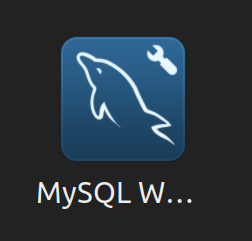
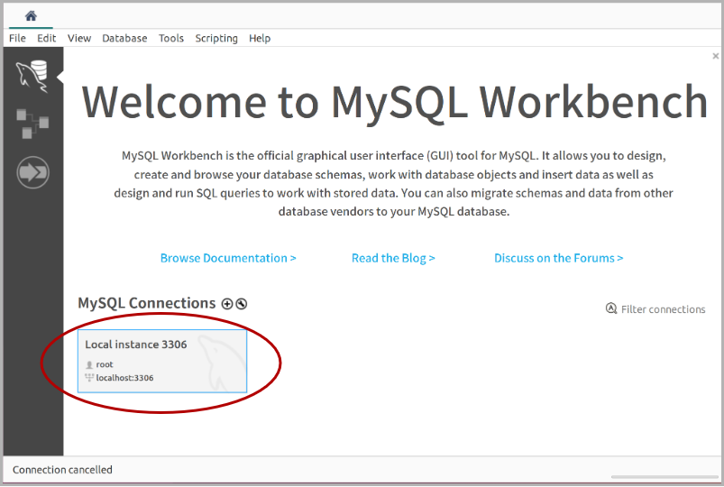

# 体验 MySQL 官方桌面客户端 Workbench<!-- omit in toc -->

## 目录<!-- omit in toc -->

- [1. 下载和安装](#1-下载和安装)
- [2. 连接数据库](#2-连接数据库)
- [3. 数据浏览](#3-数据浏览)
- [4. 工作台](#4-工作台)
- [5. 分析工具](#5-分析工具)
- [6. 发布订阅](#6-发布订阅)

## 1. 下载和安装

```sh
# 下载官方 APT 存储库包
$ wget https://dev.mysql.com/get/mysql-apt-config_0.8.26-1_all.deb

# 更新软件包管理系统的软件包列表和元数据
$ sudo dpkg -i mysql-apt-config_0.8.26-1_all.deb
$ sudo apt-get update

# 安装
$ sudo apt-get install mysql-workbench-community
```

安装成功后显示如下图标：



<!--  -->
<!--  -->
<!--  -->
<!--  -->
<!--  -->
<!--  -->

## 2. 连接数据库

打开 Workbench，程序已经添加了默认的连接，点击打开：



2. 填写连接信息，测试连接，并保存：


## 3. 数据浏览

可以通过数据类型、键名、模式匹配来检索数据；点击右上角的添加按钮进入添加页面：


## 4. 工作台

可以在工作台直接执行命令，会自动根据输入的内容智能提示和补全：


## 5. 分析工具

在分析工具页面，可以通过多种维度查看当前数据的统计信息：


## 6. 发布订阅

在发布订阅页面，可以实时订阅消息，或发布消息：


